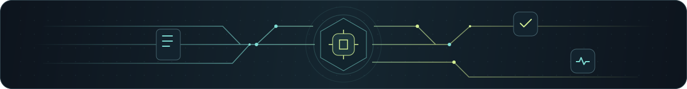

  

<h1 align="center">Muhammad Daniyal</h1>

  <strong>AI Systems Engineer focused on RAG &amp; AI Knowledge Systems for B2B SaaS.</strong>

 

I build independent AI systems around document ingestion, retrieval, source-grounded answers, multi-tenant boundaries, evaluation, observability, and supporting AI workflows.

I publish and organize this independent work under the **AgenticCore** name, which I use as a personal technical brand.

> DocuMind and LeadCore are independent technical/product builds, not client deployments.

 

##  Selected Independent Builds

<table width="100%">
<tr>
<td width="1000">
<h3> DocuMind AI</h3>

My primary RAG / AI knowledge-system build.

It explores:

<ul>
  <li>document and knowledge ingestion</li>
  <li>chunking and embeddings</li>
  <li>retrieval</li>
  <li>source-grounded generation</li>
  <li>citations</li>
  <li>multi-tenant workspaces</li>
  <li>authentication/security boundaries</li>
  <li>evaluation and observability</li>
</ul>

 <a href="https://github.com/danyorllc-stack/documind-ai"><strong>Repository</strong></a> ·  <a href="https://documind.agenticcore.tech"><strong>Live demo</strong></a>

</td>
</tr>
</table>

<table width="100%">
<tr>
<td width="1000">
<h3> LeadCore AI</h3>

Secondary AI workflow proof demonstrating:

<ul>
  <li>embeddable conversational workflows</li>
  <li>structured information extraction</li>
  <li>deterministic lead scoring</li>
  <li>multi-tenant workspaces</li>
  <li>email/webhook routing</li>
</ul>

 <a href="https://github.com/danyorllc-stack/leadcore-ai"><strong>Repository</strong></a> ·  <a href="https://leadcore.agenticcore.tech"><strong>Live demo</strong></a>

</td>
</tr>
</table>

 

##  Technical Focus

<table width="100%">
<tr>
  <td width="50%"> Retrieval-Augmented Generation</td>
  <td width="50%"> Document intelligence</td>
</tr>
<tr>
  <td width="50%"> Retrieval and vector search</td>
  <td width="50%"> Source-grounded generation</td>
</tr>
<tr>
  <td width="50%"> Citations</td>
  <td width="50%"> Multi-tenant SaaS architecture</td>
</tr>
<tr>
  <td width="50%"> Authentication and authorization</td>
  <td width="50%"> Evaluation and observability</td>
</tr>
<tr>
  <td width="50%"> TypeScript AI backends</td>
  <td width="50%"> AI workflows</td>
</tr>
</table>

 

##  Links

 **Portfolio:** [agenticcore.tech](https://agenticcore.tech/)

 **LinkedIn:** [linkedin.com/in/daniyal-agenticcore](https://www.linkedin.com/in/daniyal-agenticcore/)
